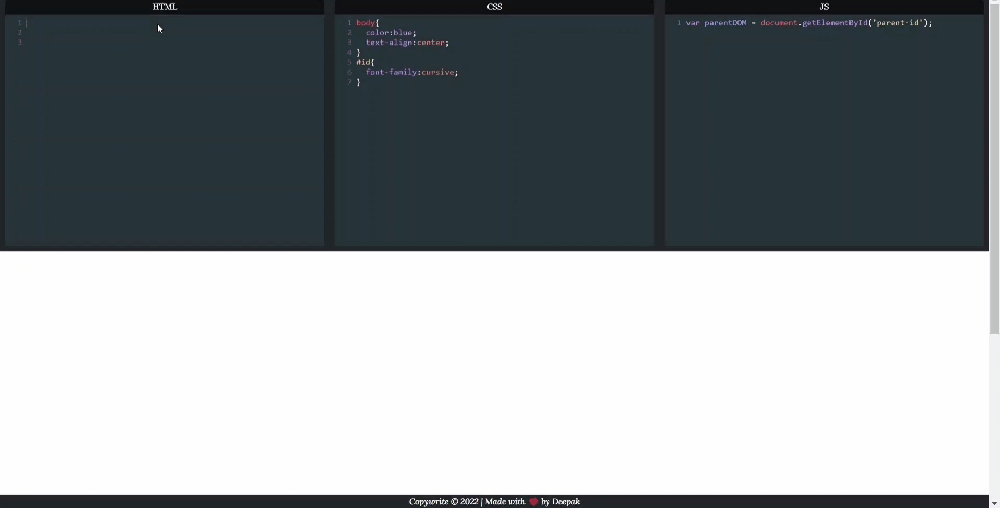

# Editor.io ❤️

Editor.io is open source web application. It is a social development environment for front-end designers and developers. Build and deploy a website, show off your work, build test cases to learn and debug, 

## Online code editor for HTML, CSS and Javascript to discover frontend code

  

### Features:

- No installation, work online and build web pages.
- Auto Save of all your work
- Supports JQuery
- Autoclose of tags and brackets
- Live Preview

## Features

- GFM
- Supports Html Tags
- Custom toolbar to make editing easier
- Live Preview
- Auto save of work
- Download the file Readme.md file

### Show your support

Give a ⭐ if you like this website!

